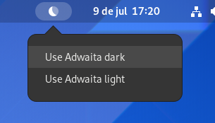

# Theme Variant Switcher

[GNOME Shell Extension](https://gitlab.gnome.org/GNOME/gnome-shell) to switch between Adwaita dark and light theme variants.



## How to install

Clone this Git repository inside the [user extensions directory](https://wiki.gnome.org/Initiatives/GnomeGoals/XDGConfigFolders) and name the folder as the `uuid` fields from [metadata.json](https://github.com/lucasvalenteds/theme-variant-switcher/blob/master/metadata.json#L4).

```
$ tree ~/.local/share/gnome-shell/extensions
.
└── theme-variant-switcher@example.com
    ├── extension.js
    ├── metadata.json
    ├── preview
    │   ├── demo.gif
    │   └── tray.png
    └── README.md
```

| Description | Command |
| :--- | :--- |
| Enable the extension | `gnome-extensions enable <uuid>` |
| Disable the extension | `gnome-extensions disable <uuid>` |

## How to run

| Description | Command |
| :--- | :--- |
| Install dependencies | `npm install` |
| Format the code | `npm run lint` |

## Preview


